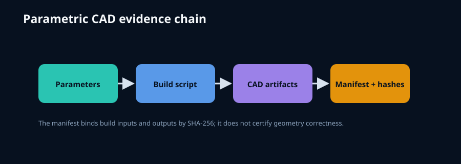

# parametric-cad-evidence-pipeline



A compact Python library for binding parameters, CAD source files, and exported artifacts
into a content-addressed build manifest. It is CAD-kernel neutral and dependency-free.

```python
from cad_evidence import build_manifest, verify_manifest
manifest=build_manifest(".",["build.py"],["part.step"],{"length_mm":20})
assert verify_manifest(".",manifest)==[]
```

Run `python tools/generate_figure.py` and `python -m unittest discover -s tests -v`. The workflow is extracted from the
evidence discipline used across [VOLLEY](https://github.com/aaaaaaaaaaaavm/VOLLEY), which
remains the flagship project.
